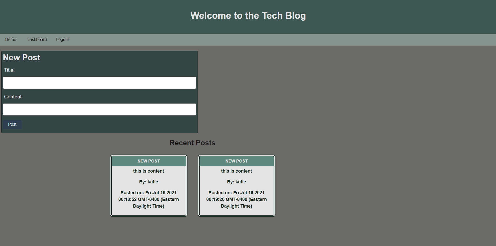

# Tech Blog 
 

 
 ## Description 
 This application allows you to blog and see other's blogs as well as comment on them. You will be able to see edit and delete buttons on your own posts and not on others 

 
 
 ## Table of Contents 

 * [Installation](#installation) 

 * [Usage](#usage) 

 * [License](#license) 

 * [Contributing](#contributing) 

 * [Tests](#Tests) 

 * [Questions](#questions)

 
 ## Installation 
to install download repository

 
 ## Usage 
 To use this application just type npm start or follow the link https://tech-blog-hw-14.herokuapp.com/

 
 ## License 
 This application uses a license from MIT 
  
 * Link: https://opensource.org/licenses/MIT

 
 ## Contributing 
 none

 
 ## Tests 
 none

 
 ## Questions 
 Please find me on GitHub or email me with further questions:

 * GitHub: [kashelton17](https://github.com/kashelton17)

 * Email: kashelton17@gmail.com 
